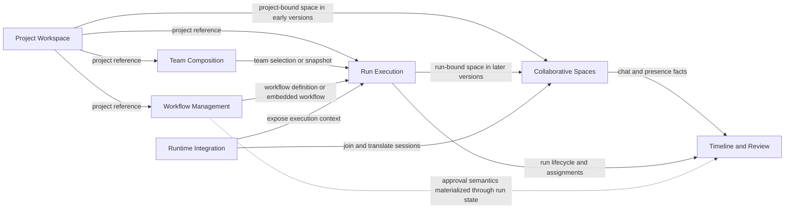

# Architecture Reference

## Parent PRD

[PRD: Agent Team Project Platform](./prd-agent-team-project-platform.md)

## Purpose

This document captures the stable domain and architecture decisions that should guide implementation across the application.

It is not a second PRD, and it is not a detailed technical design for every feature. Its job is narrower:

- define the main bounded contexts
- define the core entities and identities
- clarify which context owns which decisions
- clarify how contexts interact

When implementation reveals a cross-cutting model decision, update this document instead of leaving that decision implicit in one feature note or one code path.

## Core Principles

- Keep one fully working active collaboration context throughout incremental delivery for the web client and all shipped connectors.
- Treat durable domain state and ephemeral realtime session state as different concerns.
- Keep storage records, domain models, and shared transport DTOs separate, with explicit mapping at boundaries.
- Prefer deep modules with narrow interfaces over transport-driven shared state.
- Keep names user-facing and mutable; keep identifiers opaque and stable.
- Favor references between bounded contexts over leaking one context's internal model into another.

## Ubiquitous Language

- `Project`: the durable root object that binds the product to a local codebase.
- `Role`: a reusable or project-local agent persona definition.
- `Team`: a saved composition of roles for repeated use.
- `Workflow`: a reusable or embedded execution design that defines phases, ordering, approvals, and lane structure.
- `Run`: a concrete execution instance created for a piece of work inside a project.
- `Collaboration Space`: the active shared conversation and presence context attached to a project or run.
- `Workspace Allocation`: the execution location assigned to a run participant or lane.
- `Runtime Session`: the live connection between an external runtime and the internal collaboration model.

## Identity And Naming Rules

- All first-class entity identifiers must be opaque UUIDs.
- Human-readable names are labels, not primary identifiers.
- Persistent identifiers must not be derived from project names, role names, team names, workflow names, run titles, filesystem paths, or other display-oriented values.
- If two entities have a one-to-one mapping in an early version, they may intentionally reuse the same UUID value, but that must be an explicit design choice rather than derived-name generation.

This rule applies to at least:

- `Project.id`
- `Role.id`
- `Team.id`
- `Workflow.id` if workflows become first-class
- `Run.id`
- `CollaborationSpace.id` or persisted `channel_id`
- any later durable workspace, timeline, or review entity that needs identity

## Bounded Contexts

### Project Workspace

This context owns the durable attachment between the product and a local codebase.

Owns:

- `Project`
- project metadata
- project root binding

Primary responsibilities:

- register and list projects
- bind a project to a filesystem root
- provide the root identifier that other project-scoped contexts reference

Key rule:

- `Project` is the durable root container in the early product shape, but it should not become an overloaded bag of unrelated execution state.

### Team Composition

This context owns who can participate in a collaboration and how saved teams are defined.

Owns:

- `Role`
- `Team`
- team membership definitions
- visible role scope metadata

Likely internal concepts:

- user-scoped role definitions
- project-scoped role definitions
- team member slots or team-role assignments
- optional future team-level collaboration preferences that are about composition rather than execution

Primary responsibilities:

- manage reusable and project-scoped roles
- define saved teams for a project
- validate that a team references valid roles
- preserve stable identity for roles and teams

Key rule:

- team composition defines the intended lineup, not the live execution state.
- if a rule is about who is on the team or their standing responsibilities, it belongs here; if it is about phase sequencing, approvals, or concurrency, it belongs to Workflow Management.

### Workflow Management

This context owns how work is supposed to progress.

Owns:

- workflow or playbook definitions
- phase definitions
- ordering and concurrency rules
- approval policy definitions
- lane templates when workflows support parallel execution

Primary responsibilities:

- define the structure of execution
- express whether work is sequential or parallel
- define where approvals are required
- provide reusable or embedded workflow designs for runs

Key rule:

- workflow management defines the intended control model; it does not own the live execution instance.
- if a rule shapes how work progresses over time, it belongs here rather than in `Team`.

### Run Execution

This context owns the live and historical execution of a piece of work.

Owns:

- `Run`
- run status
- current phase state
- run participant assignments
- workspace assignments
- run-level execution decisions and transitions

Likely internal concepts:

- run input or invocation command
- run snapshot of selected team composition
- run snapshot or binding to workflow definition
- phase instances
- lane instances
- participant assignments
- workspace allocation decisions

Primary responsibilities:

- create and progress runs
- bind a run to a project
- instantiate team and workflow inputs into a concrete execution instance
- track live status, transitions, and execution assignments

Key rules:

- `Run` is the authoritative execution context once the product moves from project chat to run chat.
- Run execution should consume stable references or snapshots from Team Composition and Workflow Management rather than reaching into their mutable internals at arbitrary times.

### Collaborative Spaces

This context owns conversation, presence, and active shared interaction surfaces.

Owns:

- `CollaborationSpace`
- membership and presence
- chat messages
- message routing
- attachment of a space to a project or run

Likely internal concepts:

- space binding
- participant presence
- message stream
- room/channel transport identity

Primary responsibilities:

- provide a shared communication surface
- keep membership and message routing scoped to the bound context
- expose the active collaboration surface to humans and runtimes

Key rules:

- collaboration spaces carry conversation and presence, not the source of truth for execution state
- a collaboration space may be attached to a `Project` in earlier versions and to a `Run` in later versions
- if a question is "who is here and what was said?", it belongs here; if it is "what is the current task state?", it belongs to Run Execution.

### Runtime Integration

This context is the anti-corruption and adapter layer around external agent runtimes.

Owns:

- `RuntimeSession`
- runtime identity metadata
- runtime capability metadata
- connector-facing handshake and translation logic

Primary responsibilities:

- map runtime-specific connection models into the internal collaboration model
- expose runtime capabilities without polluting the core domain with vendor-specific assumptions
- join the correct collaboration and execution contexts

Key rule:

- runtime integration should translate into the core domain, not redefine it.

## Context Categories

The early model benefits from separating catalog/design-time concerns from live execution concerns.

Catalog and design-time contexts:

- `Project Workspace`
- `Team Composition`
- `Workflow Management`

Operational/runtime contexts:

- `Run Execution`
- `Collaborative Spaces`
- `Runtime Integration`

Integration/projection layer:

- timeline and review views built from facts owned elsewhere

## Context Map

Reading guide:

- `Project Workspace`, `Team Composition`, and `Workflow Management` are mostly catalog and design-time contexts.
- `Run Execution`, `Collaborative Spaces`, and `Runtime Integration` are operational contexts.
- `Timeline and Review` is a projection over facts from other contexts rather than the default source of truth.

## Supporting Models And Read Models

### Workspace Allocation

Workspace allocation is currently best treated as part of Run Execution rather than as a separate top-level bounded context.

Reason:

- allocation decisions only make sense in relation to a concrete run, participant, or lane
- the core business question is an execution question: who should operate where right now

If workspace lifecycle and inventory later become substantially richer, they may justify a dedicated context. Until then, keep the write authority with Run Execution.

### Timeline And Review

The timeline should be treated as an integration-oriented read model, not the primary write authority of the domain.

It combines facts from multiple contexts such as:

- collaboration messages from Collaborative Spaces
- run lifecycle and phase transitions from Run Execution
- workflow-related approval facts materialized through Run Execution
- human review activity

Reason:

- chat, approvals, and run transitions have different write authorities
- forcing them into one "timeline-owned" model would blur boundaries instead of clarifying them

The timeline may later need durable storage, but it should still be modeled as a projection or reconstructed history of authoritative events rather than as the source of truth for all those concerns.

## Context Interactions

### Project Workspace -> Other Contexts

- Other project-scoped contexts reference `Project.id`.
- Project Workspace does not own their internal models.

### Team Composition -> Run Execution

- Run Execution consumes a selected team as an input.
- The run should capture enough team information at invocation time to remain historically understandable even if the saved team changes later.
- Exact snapshot depth is still open, but the run must not depend on live mutable team definitions for basic historical meaning.

### Workflow Management -> Run Execution

- Run Execution consumes a workflow definition or embedded workflow payload as an input.
- Workflow Management defines the control structure; Run Execution owns the live progression state.

### Run Execution <-> Collaborative Spaces

- A collaboration space is attached to a project or run by explicit binding.
- Collaborative Spaces route messages and presence for the bound context.
- Run Execution remains authoritative for run lifecycle, participants, and phase state.

### Runtime Integration -> Collaborative Spaces And Run Execution

- Runtime Integration joins sessions to the right collaboration space.
- Runtime Integration may expose execution context to runtimes, but it should not own execution semantics.

### Timeline / Review <- Multiple Contexts

- Timeline and review views are projections over authoritative events and facts coming from other contexts.
- They are consumers and presenters of domain activity, not the default write model for all of it.

## Boundary Rules

- Each bounded context should expose domain-oriented interfaces, not storage-shaped structures.
- Contexts should communicate through explicit references, commands, queries, snapshots, or domain events rather than by sharing mutable in-memory maps.
- Route handlers, websocket handlers, and orchestration logic should depend on context-owned services or inventory interfaces.
- Realtime presence state may remain in dedicated in-memory coordination structures without forcing the same abstraction shape as durable domain collections.

## Module And Interface Rules

Treat each bounded context as a module with a narrow public surface.

The default rule is:

- one context must not import another context's internals

Allowed cross-context dependencies:

- a published interface or port from another context
- a small shared kernel of low-level primitives such as UUID types, timestamps, or transport-neutral result shapes
- explicit cross-context contracts such as commands, queries, events, or snapshots

Disallowed cross-context dependencies:

- another context's entities used as local domain objects
- another context's repositories, inventories, or storage records
- another context's internal services
- direct access to another context's mutable state

Practical interpretation:

- import another context's public API, not its private model
- cross boundaries by ID, reference, snapshot, command, query, or event
- never treat another context's internal entity shape as your own source of truth

Examples:

- `Run Execution` may request a validated team reference or team snapshot from `Team Composition`
- `Run Execution` may consume a workflow definition or embedded workflow payload from `Workflow Management`
- `Collaborative Spaces` may bind to `project_id` or `run_id` without importing project or run internals
- `Runtime Integration` may call public ports in `Collaborative Spaces` and `Run Execution` without importing their internal domain models

## Recommended Module Shape

For each context, prefer a structure with a clear public boundary.

Suggested pattern:

- `domain/`
- `application/`
- `infrastructure/`
- `public.ts`

Meaning:

- `domain/` contains entities, value objects, invariants, and domain services internal to the context
- `application/` contains use cases, orchestration, ports, and command/query handlers for the context
- `infrastructure/` contains adapters such as in-memory inventories, persistence mappers, and transport wiring support
- `public.ts` is the only intended cross-context import surface

Cross-context rule:

- another context should import from `public.ts`, not from files inside `domain/`, `application/`, or `infrastructure/`

What `public.ts` may expose:

- interfaces and ports
- command and query types
- event types intended for cross-context consumption
- reference or snapshot DTOs
- factory functions for wiring the context

What `public.ts` should avoid exposing:

- storage record types
- internal entity implementations
- internal helper functions
- transport-specific request handlers unless that transport is itself the module boundary

## Backend And Frontend Alignment

These domain boundaries are backend-first.

Meaning:

- the backend domain is the authoritative place where ownership, invariants, and cross-context rules are enforced
- the frontend should not invent a conflicting domain split just because the UI is convenient to build around a flatter state model

The frontend may still benefit from aligned module boundaries.

Recommended frontend interpretation:

- mirror bounded contexts through app-facing services, stores, or state modules where that improves clarity
- consume backend-facing contracts through those context-shaped services instead of one large transport-driven chat store
- keep frontend view models free to differ from backend entities, but do not redefine ownership rules or cross-context coupling

Good examples:

- a frontend project workspace service
- a frontend team composition service
- a frontend run execution service
- a frontend collaboration-space service

The goal is not strict backend/frontend type sharing. The goal is consistent boundaries and clearer application structure.

Expected interface examples:

- `ProjectInventory`
- `RoleInventory`
- `TeamInventory`
- `WorkflowInventory` if workflows become first-class durable objects
- `RunInventory` or a run orchestration service
- projection-oriented timeline services if timeline storage becomes durable

## Current Design Tensions

These are the places where implementation should stay conscious and explicit:

- whether `Run` should snapshot team composition fully, partially, or by stable reference plus copied display fields
- whether workflows are embedded in runs first or promoted immediately to a reusable first-class object
- how much of approval policy belongs to reusable workflow definitions versus run-level overrides
- whether collaboration spaces should become first-class durable objects early or remain attached coordination structures with durable identifiers

## Related Documents

- [PRD: Agent Team Project Platform](./prd-agent-team-project-platform.md)
- [Amendment: Storage Abstraction And DTO Decoupling](./prd-agent-team-project-platform-amendment-storage-abstraction.md)
